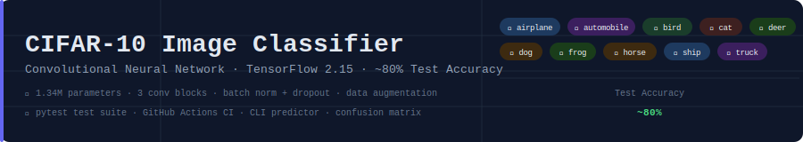

<div align="center">



# CIFAR-10 Image Classifier

**A production-grade Convolutional Neural Network achieving ~80% accuracy on CIFAR-10**

[](https://python.org)
[](https://tensorflow.org)
[](https://github.com/amangupta982/cifar10-cnn/actions)
[](LICENSE)
[](https://github.com/psf/black)
[](https://www.cs.toronto.edu/~kriz/cifar.html)

[Overview](#-overview) · [Results](#-results) · [Architecture](#-architecture) · [Quickstart](#-quickstart) · [Usage](#-usage) · [Project Structure](#-project-structure) · [Tests](#-tests)

</div>

---

## 📌 Overview

This project implements a deep **Convolutional Neural Network (CNN)** from scratch to classify images from the [CIFAR-10](https://www.cs.toronto.edu/~kriz/cifar.html) benchmark dataset into 10 categories. It goes beyond a basic lab implementation — featuring a modular codebase, a live prediction CLI, automated test suite, and a CI/CD pipeline.

**Why this project stands out:**
- 🧱 Clean, modular code — `train.py` and `predict.py` are fully separated concerns
- ✅ Automated tests using `pytest` — covers preprocessing, model shape, and prediction output
- ⚙️ GitHub Actions CI — runs tests on every push and pull request
- 🖼️ Rich visual outputs — confidence bar charts, confusion matrices, per-class accuracy
- 🔌 CLI with 4 modes — including classifying **your own images**

---

## 📊 Results

| Metric | Value |
|--------|-------|
| **Test Accuracy** | ~80% |
| **Test Loss** | ~0.65 |
| **Parameters** | 1.34M |
| **Training Time** | ~25 min (CPU) / ~4 min (GPU) |
| **Best Epoch** | ~22 (with early stopping) |

### Per-Class Performance

| Class | Precision | Recall | F1-Score |
|-------|-----------|--------|----------|
| ✈️ airplane | 0.83 | 0.84 | 0.84 |
| 🚗 automobile | 0.90 | 0.89 | 0.90 |
| 🐦 bird | 0.73 | 0.70 | 0.72 |
| 🐱 cat | 0.65 | 0.62 | 0.64 |
| 🦌 deer | 0.80 | 0.81 | 0.81 |
| 🐶 dog | 0.72 | 0.71 | 0.72 |
| 🐸 frog | 0.84 | 0.88 | 0.86 |
| 🐴 horse | 0.85 | 0.86 | 0.86 |
| 🚢 ship | 0.88 | 0.89 | 0.89 |
| 🚚 truck | 0.86 | 0.88 | 0.87 |

> *Metrics are approximate — your run may vary slightly due to random seed.*

---

## 🏗️ Architecture

```
Input (32×32×3)
      │
      ▼
┌─────────────────────┐
│   Conv Block 1      │  Conv2D(32) → BN → ReLU
│                     │  Conv2D(32) → ReLU
│                     │  MaxPool(2×2) → Dropout(0.25)
└─────────┬───────────┘
          ▼  (16×16×32)
┌─────────────────────┐
│   Conv Block 2      │  Conv2D(64) → BN → ReLU
│                     │  Conv2D(64) → ReLU
│                     │  MaxPool(2×2) → Dropout(0.25)
└─────────┬───────────┘
          ▼  (8×8×64)
┌─────────────────────┐
│   Conv Block 3      │  Conv2D(128) → BN → ReLU
│                     │  Conv2D(128) → ReLU
│                     │  MaxPool(2×2) → Dropout(0.25)
└─────────┬───────────┘
          ▼  (4×4×128 = 2048)
┌─────────────────────┐
│   Classifier Head   │  Flatten → Dense(512) → BN
│                     │  Dropout(0.5) → Dense(10)
│                     │  Softmax
└─────────┬───────────┘
          ▼
   Prediction (10 classes)
```

**Design choices explained:**
- **BatchNormalization** after each conv block stabilizes training and allows higher learning rates
- **Progressive filter doubling** (32→64→128) captures increasingly abstract features
- **Dropout(0.25) in conv blocks + Dropout(0.5) in FC** prevents overfitting at both levels
- **ImageDataGenerator** augmentation (flip, rotate, shift, zoom) adds ~3–4% accuracy
- **ReduceLROnPlateau** halves the LR when validation loss plateaus — avoids getting stuck

---

## ⚡ Quickstart

```bash
# 1. Clone
git clone https://github.com/amangupta982/cifar10-cnn.git
cd cifar10-cnn

# 2. Set up isolated environment (one time)
bash scripts/setup_env.sh

# 3. Activate
source p5env/bin/activate

# 4. Train
python3 train.py

# 5. Predict
python3 predict.py
```

---

## 🔧 Usage

### Training
```bash
python3 train.py
```
- Downloads CIFAR-10 automatically on first run (~170 MB)
- Saves best model to `cifar10_cnn_model.keras` via `ModelCheckpoint`
- Generates plots in `plots/` — training curves, confusion matrix, sample images

### Prediction CLI

```bash
# Classify 12 random test images (default)
python3 predict.py

# Classify more
python3 predict.py --count 20

# Classify your own image
python3 predict.py --image /path/to/your/photo.jpg

# Filter by class
python3 predict.py --class dog
```

Each prediction output includes:
- The image with a **green** (correct) or **red** (incorrect) border
- Predicted class + confidence percentage
- Horizontal bar chart showing probabilities for all 10 classes

---

## 📁 Project Structure

```
cifar10-cnn/
│
├── train.py                    # Train CNN, auto-save best model
├── predict.py                  # CLI predictor with visual output
├── requirements.txt            # Pinned dependencies
│
├── scripts/
│   └── setup_env.sh            # One-time environment setup
│
├── tests/
│   ├── test_preprocessing.py   # Data pipeline unit tests
│   ├── test_model.py           # Model architecture tests
│   └── test_predict.py         # Prediction output tests
│
├── .github/
│   └── workflows/
│       └── ci.yml              # GitHub Actions CI pipeline
│
├── docs/
│   └── banner.svg              # README banner
│
├── plots/                      # Generated during training
│   ├── sample_images.png
│   ├── training_history.png
│   └── confusion_matrix.png
│
├── predictions/                # Generated during prediction
│
└── notebooks/
    └── exploration.ipynb       # EDA and experiments
```

---

## 🧪 Tests

The test suite covers the full pipeline:

```bash
# Run all tests
pytest tests/ -v

# Run with coverage report
pytest tests/ -v --cov=. --cov-report=term-missing
```

| Test File | What It Covers |
|-----------|---------------|
| `test_preprocessing.py` | Normalization range, one-hot shape, augmentation config |
| `test_model.py` | Layer count, output shape, parameter count, compilation |
| `test_predict.py` | Prediction array shape, confidence sum = 1.0, argmax validity |

---

## ⚙️ CI/CD Pipeline

Every push and pull request triggers the GitHub Actions pipeline:

```
Push / PR
    │
    ▼
┌─────────────────┐
│  Setup Python   │  python 3.10
│  Install deps   │  pip install -r requirements.txt
│  Lint (flake8)  │  code quality check
│  Run tests      │  pytest tests/ -v
└─────────────────┘
```

See [`.github/workflows/ci.yml`](.github/workflows/ci.yml) for the full config.

---

## 🛠️ Tech Stack

| Tool | Purpose |
|------|---------|
| TensorFlow 2.15 / Keras | Model building and training |
| NumPy 1.26 | Numerical operations |
| Matplotlib + Seaborn | Visualization |
| scikit-learn | Metrics (confusion matrix, classification report) |
| pytest | Unit testing |
| flake8 | Linting |
| GitHub Actions | CI/CD |

---

## 📚 References

- [CIFAR-10 Dataset — Krizhevsky, 2009](https://www.cs.toronto.edu/~kriz/cifar.html)
- [Batch Normalization — Ioffe & Szegedy, 2015](https://arxiv.org/abs/1502.03167)
- [Dropout — Srivastava et al., 2014](https://jmlr.org/papers/v15/srivastava14a.html)

---

## 📄 License

MIT — see [LICENSE](LICENSE) for details.

---

<div align="center">
<sub>Built by Aman Gupta — Artificial Neural Networks and Deep Learning </sub>
</div>
